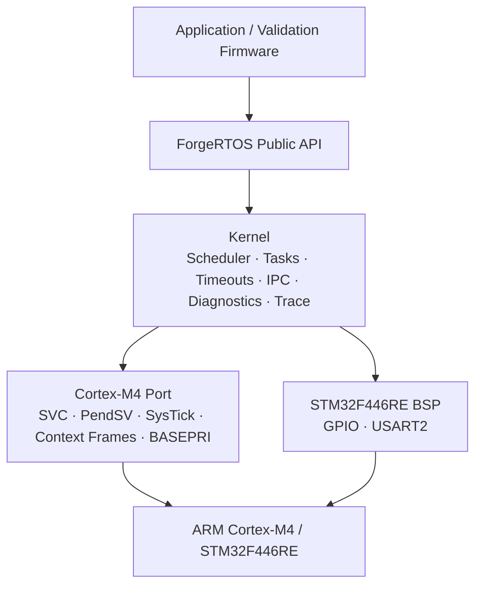
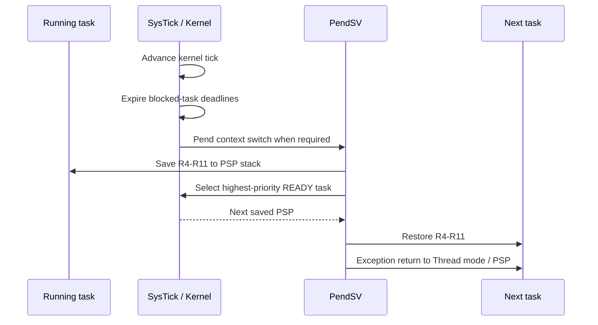
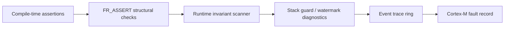

# ForgeRTOS

[](#version)
[](#target-platform)
[](#target-platform)
[](#target-platform)
[](#building)

ForgeRTOS is a compact preemptive real-time operating system kernel for ARM Cortex-M4, implemented from scratch in C11 and ARM Thumb assembly for the STM32F446RE.

The project focuses on the mechanisms that make an RTOS work at the hardware/software boundary: exception-driven context switching, fixed-priority scheduling, synchronization, blocking IPC, timeout management, priority inheritance, stack diagnostics, runtime invariant checking, event tracing, and low-level UART observability. It does not wrap an existing RTOS or CMSIS-RTOS abstraction.

## Architecture at a glance



## Key features

- Bare-metal STM32F446RE startup, linker script, vector table, and PSP-based thread execution
- Preemptive fixed-priority scheduler with round-robin scheduling among equal-priority tasks
- PendSV context switching with software preservation of R4-R11
- 1 kHz SysTick time base with wrap-safe tick/deadline arithmetic
- Nested BASEPRI critical sections and explicit kernel interrupt-priority rules
- Kernel-owned idle task using `WFI`
- Task sleep, BLOCKED state, finite timeouts, and indefinite waits
- Binary and counting semaphores
- Non-recursive mutexes with direct ownership handoff and priority inheritance
- Fixed-capacity message queues with blocking send/receive
- Event flags with wait-any, wait-all, and clear-on-exit semantics
- Stack watermark, guard-region, saved-SP, and overflow diagnostics
- Kernel assertions and cross-TCB runtime invariant scanning
- Fixed-capacity event trace ring with chronological snapshots
- Register-level USART2 monitor through the NUCLEO-F446RE ST-LINK virtual COM port
- Separate release/demo and integration-validation firmware images

## Target platform

| Item | Configuration |
|---|---|
| Development board | STM32 Nucleo-F446RE |
| MCU | STM32F446RE |
| CPU | ARM Cortex-M4 |
| Core clock | 16 MHz HSI |
| Kernel tick | 1 kHz |
| UART monitor | USART2, PA2/PA3, 115200 8-N-1 |
| Toolchain | `arm-none-eabi-gcc` |
| Build system | CMake + Ninja |
| Languages | C11 + ARM Thumb assembly |
| Dynamic allocation | None |

## Scheduling and context switching



Scheduling is fixed-priority and preemptive. Equal-priority READY tasks are rotated round-robin. Synchronization objects interact with the scheduler through BLOCKED/READY transitions rather than busy waiting. Mutex contention can temporarily raise an owner's effective priority; the configured base priority remains unchanged.

## Repository layout

```text
ForgeRTOS/
├── bsp/stm32f446re/          Board support and USART2 driver
├── cmake/                    Cross-toolchain configuration
├── docs/                     Architecture, validation, metrics, and monitor docs
├── include/forge/            Public kernel interfaces
├── kernel/                   Architecture-independent kernel implementation
│   └── include/forge/kernel/ Internal kernel interfaces
├── linker/                   STM32F446RE linker script
├── port/cortex_m4/           Cortex-M4 port and assembly context-switch path
├── src/                      Small release demonstration firmware
├── startup/                  Reset code and exception vector table
└── tests/integration/        Regression and stress-validation firmware
```

The full validation harness intentionally remains in the repository, but it is isolated from the release application. The default `src/main.c` stays small and readable, while `tests/integration/` retains deterministic regression scenarios and long-running stress workloads.

See [Project Structure](docs/PROJECT_STRUCTURE.md) for the rationale and build-target split.

## Release demonstration

The default `forgertos.elf` image runs three user tasks:

| Task | Priority | Purpose |
|---|---:|---|
| Consumer | 4 | Receives queue messages, validates FIFO sequence, tracks latency |
| Producer | 3 | Publishes timestamped messages every 100 ms |
| UART monitor | 1 | Exposes status, diagnostics, and trace data |
| Idle | 0 | Kernel-owned idle execution using `WFI` |

The consumer toggles the Nucleo LED periodically, giving the release image a visible hardware-level liveness indicator in addition to the UART monitor.

### UART commands

Send one character at a time without CR/LF:

```text
h / ?   help
v       version
s       application and trace status
k       kernel invariants, assertion state, and fault state
t       newest trace entries
```

Example:

```text
ForgeRTOS v0.1.0 release demo @ 115200 8-N-1
Commands: h/? help, s status, k kernel, t trace, v version
STATUS tick=12491 tasks=3 sent=125 recv=125 q=0 latmax=1 derr=0 trace=128/128 ovw=314 rxerr=0
KERNEL tasks=3 run=1 ready=0 blocked=2 current=3 inv=0x00000000 assert=0 fault=0x00000000
```

See [UART Monitor](docs/UART_MONITOR.md) for command details.

## Validation firmware

`forgertos_validation.elf` contains the full regression and stress suite. It covers:

- task creation, PSP execution, and context preservation
- preemptive scheduling and equal-priority rotation
- sleep and timeout expiration
- binary and counting semaphores
- mutex ownership, direct handoff, timeout handling, and priority inheritance
- blocking queue send/receive, FIFO ordering, payload integrity, and latency checks
- event flags and common timeout semantics
- stack guards and high-water marks
- assertions and runtime invariants
- trace-ring wraparound
- UART monitor RX/TX behavior
- sustained mixed workload across tasks, queues, semaphores, mutexes, timing, tracing, and diagnostics

A representative soak run completed **838,432 queue sends and receives** and **26,200 mutex/priority-inheritance cycles** with all stress error counters at zero. The trace sequence exceeded **3.3 million events** while the 128-entry ring continued overwriting old entries correctly.

See [Validation](docs/VALIDATION.md) and [Metrics](docs/BENCHMARKS.md).

## Building

The project expects an ARM GCC toolchain file such as `cmake/arm-none-eabi-gcc.cmake`.

### Release image

```powershell
cmake -S . -B build -G Ninja `
  -DCMAKE_TOOLCHAIN_FILE=cmake/arm-none-eabi-gcc.cmake
cmake --build build --target forgertos.elf
```

Generated artifacts:

```text
build/forgertos.elf
build/forgertos.hex
build/forgertos.bin
build/forgertos.map
```

### Validation image

```powershell
cmake -S . -B build-validation -G Ninja `
  -DCMAKE_TOOLCHAIN_FILE=cmake/arm-none-eabi-gcc.cmake `
  -DFR_BUILD_VALIDATION=ON
cmake --build build-validation --target forgertos_validation.elf
```

Generated artifacts:

```text
build-validation/forgertos_validation.elf
build-validation/forgertos_validation.hex
build-validation/forgertos_validation.bin
build-validation/forgertos_validation.map
```

## Diagnostics

ForgeRTOS uses several complementary diagnostic mechanisms rather than treating all failures the same way:



- **Assertions** stop execution when an internal state is unsafe to continue from.
- **Invariant scans** report inconsistent scheduler/TCB state without intentionally halting the system.
- **Stack diagnostics** track historical usage and guard integrity.
- **Trace records** preserve recent scheduling/wait events without performing UART I/O in kernel hot paths.
- **Fault capture** records Cortex-M architectural fault state for post-mortem debugging.

## Documentation

- [Architecture](docs/ARCHITECTURE.md)
- [Validation](docs/VALIDATION.md)
- [Metrics and benchmark methodology](docs/BENCHMARKS.md)
- [UART monitor](docs/UART_MONITOR.md)
- [Project structure](docs/PROJECT_STRUCTURE.md)
- [Release checklist](docs/RELEASE_CHECKLIST.md)
- [Changelog](CHANGELOG.md)
- [v0.1.0 release notes](RELEASE_NOTES_v0.1.0.md)

## Version

Current release: **v0.1.0**

ForgeRTOS is an educational and portfolio RTOS kernel. It is not safety-certified and is not presented as a production replacement for a mature commercial or open-source RTOS.
