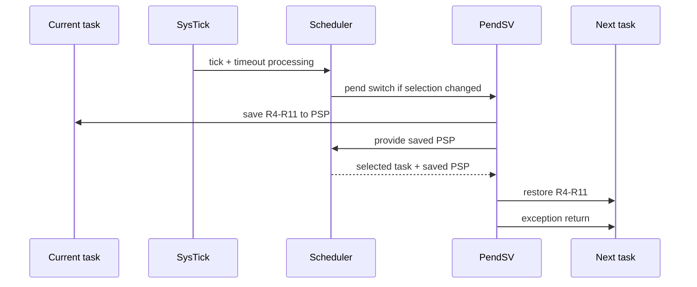

# ForgeRTOS Architecture

ForgeRTOS separates portable kernel policy from Cortex-M4 mechanism and STM32F446RE board support. The kernel owns scheduling, task state, synchronization, IPC, timeout management, diagnostics, and tracing; the Cortex-M4 port owns exception/context mechanics; the BSP owns board-specific peripheral access.

## Layered design

```mermaid
flowchart TB
    subgraph Firmware
        APP[Release application / Validation firmware]
        API[Public ForgeRTOS API]
    end

    subgraph Kernel
        TASK[Task registry and state]
        SCHED[Fixed-priority scheduler]
        WAIT[Wait / timeout engine]
        SYNC[Semaphores · Mutexes · Event flags]
        QUEUE[Message queues]
        DIAG[Assertions · Invariants · Stack diagnostics]
        TRACE[Event trace ring]
    end

    subgraph CortexM4_Port[Cortex-M4 port]
        SVC[SVC bootstrap]
        PENDSV[PendSV context switch]
        SYSTICK[SysTick preemption]
        CRIT[BASEPRI critical sections]
        FAULT[Fault capture]
    end

    subgraph BSP
        GPIO[GPIO / board LED]
        UART[USART2 monitor transport]
    end

    HW[STM32F446RE / ARM Cortex-M4]

    APP --> API
    API --> TASK
    API --> SYNC
    API --> QUEUE
    TASK --> SCHED
    SYNC --> WAIT
    QUEUE --> WAIT
    WAIT --> SCHED
    SCHED --> PENDSV
    SYSTICK --> SCHED
    DIAG --> TASK
    TRACE --> SCHED
    PENDSV --> HW
    SVC --> HW
    SYSTICK --> HW
    CRIT --> HW
    FAULT --> HW
    GPIO --> HW
    UART --> HW
```



## Boot and execution model

1. Reset begins on the Main Stack Pointer (MSP) through the custom startup code and vector table.
2. The bootstrap path prepares a Process Stack Pointer (PSP) stack and transfers Thread mode to PSP execution.
3. Kernel/platform subsystems are initialized before the scheduler starts.
4. Each task receives a synthetic Cortex-M exception frame and software-saved register frame.
5. The scheduler starts the highest-priority READY task through the Cortex-M exception-return model.
6. Subsequent task-to-task switches use PendSV.

Thread-mode tasks execute on PSP. Exception handlers execute using the Cortex-M exception model and retain MSP for handler-mode execution.

## Task model

Each task control block tracks at least:

- saved PSP
- stack base/top and configured size
- entry function and argument
- task ID
- base priority and effective priority
- execution state
- wait reason, object, result, and optional absolute deadline
- event-flag wait metadata when applicable

Task states are:

```text
CREATED → READY ↔ RUNNING
                    │
                    ├──> BLOCKED ──> READY
                    └──> SUSPENDED
```

`BLOCKED` is used for sleep and synchronization/IPC waits. A blocked task is not selected until its condition is signaled or its finite deadline expires.

## Scheduling

ForgeRTOS uses preemptive fixed-priority scheduling:

- numerically larger configured priority represents higher scheduling priority
- the highest-priority READY user task wins
- equal-priority tasks rotate round-robin
- a kernel-owned idle task runs only when no user task is READY
- normal tasks beat the idle task even at the lowest user priority



## Context switching

The Cortex-M hardware exception frame preserves the automatically stacked context. ForgeRTOS additionally saves/restores R4-R11 in the PendSV path. Each TCB stores the task's saved PSP, allowing the scheduler to switch stacks by selecting the next task's saved pointer.

The switch path validates stack-pointer bounds/alignment before restoring a task when assertions are enabled.

## Critical sections and interrupt policy

Kernel critical sections use nested `BASEPRI` masking rather than globally disabling all maskable interrupts.

The configured kernel ceiling masks interrupts at and below the kernel-aware priority boundary while allowing higher-urgency interrupts to remain serviceable. ISRs above the kernel ceiling must not call ForgeRTOS kernel services.

Critical sections preserve the caller's previous mask and restore it when the outermost protected region exits.

## Time and timeout model

SysTick provides a 1 kHz kernel time base. Tick arithmetic is wrap-safe within the supported finite wait horizon.

Finite waits are represented through absolute deadlines. Queue operations that may wake and retry preserve the original deadline rather than restarting the timeout budget after each wake-up. `UINT32_MAX` is reserved as the indefinite-wait sentinel for synchronization/IPC APIs.

## Synchronization

### Semaphores

- binary semaphore: 0/1 availability
- counting semaphore: bounded count
- direct waiter wake-up when a give can satisfy a blocked task

### Mutexes

Mutexes are non-recursive and enforce ownership on unlock. Contended unlocks use direct ownership handoff to the selected waiter.

Priority inheritance distinguishes:

```text
base priority      configured task priority
effective priority current scheduling priority after inheritance
```

When a higher-priority task blocks on a mutex, the owner can inherit the higher effective priority. The implementation also propagates/recomputes inheritance across mutex-wait chains and restores priorities as waiters leave or ownership changes.

### Event flags

Event flags support:

- wait-any
- wait-all
- optional clear-on-exit
- finite or indefinite waits

All matching waiters are evaluated against the same pre-clear bit snapshot before clear-on-exit masks are applied.

## Message queues

Queues use caller-provided fixed-capacity storage; no heap allocator is required.

Operations include non-blocking and blocking send/receive. A queue wake-up does not reserve an item or slot, so awakened tasks re-check the queue under the original timeout deadline. This avoids extending timeouts during wake/retry races.

## Memory model

ForgeRTOS uses statically supplied storage for task stacks and fixed-capacity kernel objects. The kernel does not provide or require a dynamic memory allocator.

This keeps allocation behavior explicit and makes the memory footprint inspectable at link time.

## Stack diagnostics

Task stacks are filled with a known pattern before the synthetic initial context is constructed. Diagnostics derive:

- configured stack size
- historical minimum free space
- historical peak use
- guard-region integrity
- saved-SP bounds
- saved-SP alignment
- overflow indication

The watermark is a diagnostic approximation rather than hardware-enforced isolation; the project does not use the MPU for per-task stack protection.

## Assertions and invariant scanning

`FR_ASSERT()` represents an internal condition that must hold for safe kernel continuation. An assertion failure captures source/expression and Cortex-M execution-mask state, then halts in a known loop.

The runtime invariant scanner performs non-destructive consistency checks across task registry, state/wait metadata, priorities, stack geometry, running-task count, and current-task relationships.

## Event tracing

The trace subsystem uses a fixed-capacity ring buffer. Kernel hot paths write compact event records containing:

```text
sequence
tick
event type
task ID
argument 0
argument 1
```

The writer performs memory operations only; it does not print from SysTick, PendSV, or synchronization paths. The UART monitor snapshots the ring from a low-priority task.

## UART monitor

USART2 is configured directly at register level for 115200 8-N-1 on PA2/PA3. On the NUCLEO-F446RE these pins are connected to the ST-LINK virtual COM port in the default board configuration.

The monitor task runs at low priority and uses a polling RX path. This design keeps serial I/O out of scheduler hot paths while remaining simple enough for kernel observability.

## Fault handling

ForgeRTOS records Cortex-M HardFault, MemManage, BusFault, and UsageFault diagnostic state. Fault capture is separate from kernel assertions: assertions represent detected software invariants, while fault handlers capture architectural exceptions raised by the processor.
