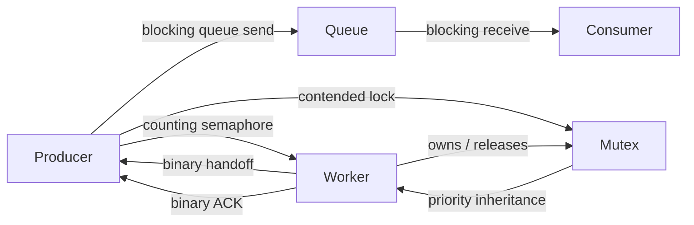

# Validation Strategy

ForgeRTOS keeps validation firmware separate from the release application. The release image demonstrates normal kernel use with a small application, while `forgertos_validation.elf` preserves deterministic regression scenarios and a sustained integration/stress workload.

This split keeps `src/main.c` reviewable without discarding the scenarios that verify scheduler, synchronization, timeout, context-switch, and diagnostic behavior.

## Validation layout

```text
tests/integration/
├── main.c      deterministic regression orchestration and monitor
├── stress.c    sustained mixed-workload stress harness
└── stress.h    stress status / control interface
```

The validation image links the same kernel, Cortex-M4 port, startup code, linker script, BSP, and UART driver as the release image. Only the application layer differs.

## Coverage

The validation firmware exercises:

1. PSP-based task execution and task creation.
2. Cooperative and preemptive context switching.
3. R4-R11 preservation across repeated PendSV switches.
4. Fixed-priority scheduling and equal-priority round robin.
5. Idle-task behavior.
6. Task sleep and deadline expiration.
7. Binary and counting semaphores.
8. Mutex ownership and non-recursive behavior.
9. Reproducible priority inversion.
10. Priority inheritance, handoff, timeout removal, and restoration.
11. Fixed-capacity queues.
12. Blocking queue send/receive and wake/retry behavior.
13. Event flags with wait-any / wait-all and clear-on-exit.
14. Common finite/indefinite synchronization timeout semantics.
15. Stack guards, watermarking, and saved-SP checks.
16. Kernel assertions and cross-TCB runtime invariants.
17. Trace-ring wraparound and chronological snapshots.
18. UART monitor RX/TX behavior.
19. Continuous queue, semaphore, mutex, priority-inheritance, timing, and stack stress.

## Sustained stress workload

The stress harness uses independent resources so it does not corrupt deterministic regression objects. It runs producer, consumer, and worker tasks alongside the normal validation tasks and UART monitor.

The workload repeatedly exercises:



The producer attaches a sequence number, production tick, pseudo-random payload, and checksum to each message. The consumer verifies FIFO order, checksum integrity, and queue latency. Synchronization cycles repeatedly force mutex contention so priority inheritance and restoration are exercised continuously rather than only once.

## Representative soak result

A representative successful run produced:

```text
STRESS run=1 sent=838432 recv=838432 q=0/8 sync=26200/26201 mutex=26200 ack=26200 err=0
STRESSCHK order=0 crc=0 laterr=0 latmax=3 qtx=0 qrx=0 ackto=0 pi=0 timing=0 stack=0
```

Interpretation:

- 838,432 messages were successfully sent and received.
- FIFO ordering and payload checksums remained correct.
- 26,200 synchronization/mutex/ACK cycles completed.
- One additional synchronization request was in flight at the instant of the snapshot (`26200/26201`).
- Maximum observed queue latency was 3 ticks in this run.
- No queue timeout, ACK timeout, priority-inheritance validation, timing, or stress-stack error was recorded.

The trace system was also observed beyond sequence number 3,332,706 while the 128-entry trace ring continued returning the newest entries in chronological order.

A separate runtime status snapshot showed:

```text
STATUS tick=161386 tasks=7 trace=128/128 ovw=2211600 tx=1237 rx=6 err=0
```

The high overwrite count is expected for a fixed 128-entry ring under a high-event-rate workload. The ring remained operational and the UART receive-error counter was zero in the captured snapshot.

## Acceptance criteria

For a clean validation run, these integration-level values must remain zero:

```text
g_fr_demo_stress_integration_errors
g_fr_demo_kernel_invariant_errors
g_fr_demo_stack_diagnostic_errors
g_fr_demo_trace_errors
g_fr_demo_uart_errors

g_fr_assert_record.magic
g_fr_assert_record.count
g_fr_fault_record.magic
```

Stress-specific error fields must also remain zero:

```text
errors
queue_send_timeouts
queue_receive_timeouts
order_errors
checksum_errors
latency_errors
mutex_lock_timeouts
ack_timeouts
priority_errors
timing_errors
stack_errors
```

Counters such as messages, synchronization cycles, mutex acquisitions, ACKs, trace sequence, and trace overwrites should continue increasing during the run.

## Building the validation image

Use a separate build directory so release and validation configuration stay independent:

```powershell
cmake -S . -B build-validation -G Ninja `
  -DCMAKE_TOOLCHAIN_FILE=cmake/arm-none-eabi-gcc.cmake `
  -DFR_BUILD_VALIDATION=ON
cmake --build build-validation --target forgertos_validation.elf
```

Generated artifacts:

```text
build-validation/forgertos_validation.elf
build-validation/forgertos_validation.hex
build-validation/forgertos_validation.bin
build-validation/forgertos_validation.map
```

Flash the validation image and open the ST-LINK virtual COM port at 115200 8-N-1. Send monitor commands as individual bytes without CR/LF:

```text
h / ?   help
s       kernel/UART/trace status
t       newest trace entries
x       stress status
c       clear trace buffer
```

For release acceptance, run the validation image without breakpoints for at least 60 seconds and confirm that all error counters remain zero.
